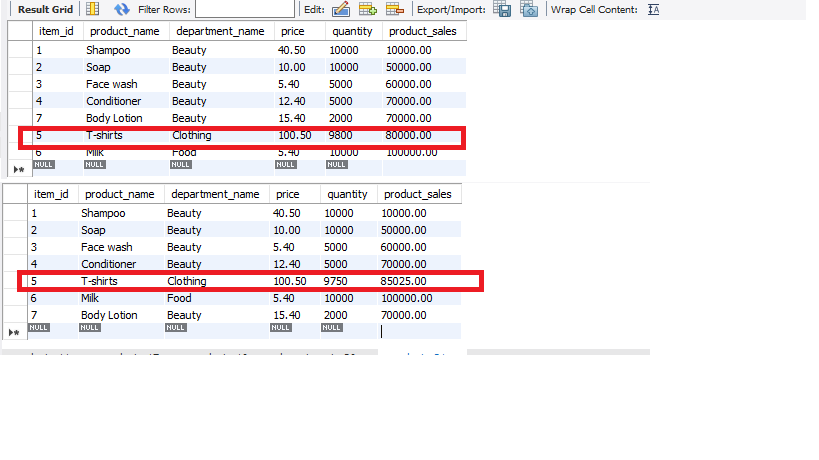
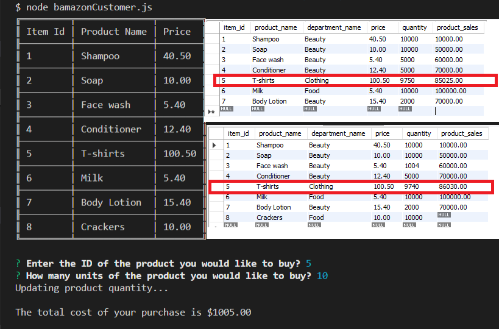
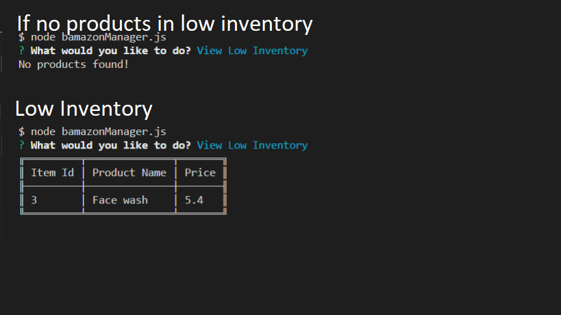
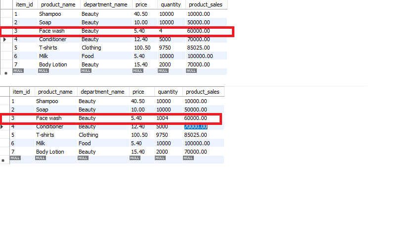
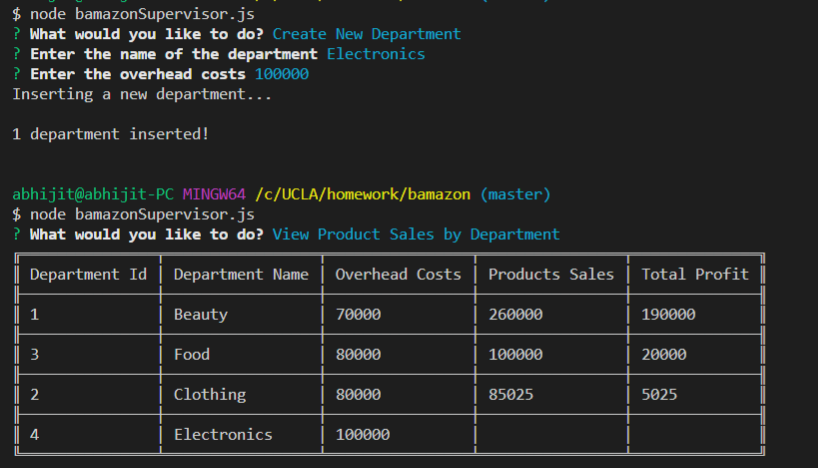

# BAMAZON

### File

* [`bamazon`](bamazon/blob/master/index.js)

### Technologies
Node, Javascript, MySql

### Description
An Amazon-like storefront which allows a customer to place an order, a store manager to add to inventory and a supervisor to view sales.

1. Link: 
    * Repo Link: https://github.com/shruti-gaonkar/bamazon

2. Customer View

    * Running a Node application called `bamazonCustomer.js` will first display all of the items available for sale. This includes the ids, names, and prices of products for sale.

    * The app then prompt users with two messages.

        * The first ask them the ID of the product they would like to buy.
        * The second message ask how many units of the product they would like to buy.

        First order by customer - Ordering T-shirts: 

        

        Product table shows quantity updated before and after ordering T-shirts

         

    * Once the customer has placed the order, the application checks if the store has enough of the product to meet the customer's request.

        * If not, the app logs a phrase like `Insufficient quantity!`, and then prevents the order from going through.

            

    * However, if the store _does_ have enough of the product, it fulfills the customer's order.
        * The SQL database shows the remaining quantity.
        * Once the update goes through, the customer sees the total cost of their purchase.    

        Second order by customer - Ordering T-shirts to show quantity and product sales updated.
        
         

3. Manager View

* A Node application called `bamazonManager.js` does the following:

  * Lists a set of menu options:

    * View Products for Sale
    
    * View Low Inventory
    
    * Add to Inventory
    
    * Add New Product

       

  * If a manager selects `View Products for Sale`, the app lists every available item: the item IDs, names, prices, and quantities.

  

  * If a manager selects `View Low Inventory`, then it lists all items with an inventory count lower than five.

  

  * If a manager selects `Add to Inventory`, then it displays a prompt that lets the manager "add more" of any item currently in the store.
    

    

    

  * If a manager selects `Add New Product`, it allows the manager to add a completely new product to the store.

  

4. Supervisor View

* A Node app called `bamazonSupervisor.js` lists a set of menu options:

    * View Product Sales by Department: When a supervisor selects `View Product Sales by Department`, the app displays a summarized table in the terminal/bash window. It also sorts the results by the highest grossing department. 

        
    
    * Create New Department

        
